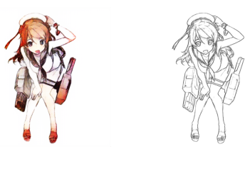

# Auto_Painter
Auto_Painter using GANS

### Overview
GANS (Generative Adversarial Networks) is composed of two neaural networks, known as Generator and Discriminator. For more info. [here](https://en.wikipedia.org/wiki/Generative_adversarial_network). The task is to generate color images from the sketch images. Here, generator generates (generated color images) and discriminator classify between (generated color images) and (real color images) wherein there will be loss from which generator will learn and finally generate (generated color images) close to (real color images). 

### Loss
This task is not accomplished by only Binary Crossentropy, we need other conventional losses to do it such as Pixel value loss, Total variantion loss, Feature loss.   

###Output

### References
Sanjay Ulsha project "Sketch2Color anime translation using Generative Adversarial Networks(GANs)" [here](https://towardsdatascience.com/sketch-to-color-anime-translation-using-generative-adversarial-networks-gans-8f4f69594aeb)

Kaggle dataset by Taebum Kim [here](https://www.kaggle.com/ktaebum/anime-sketch-colorization-pair)

Research Paper by Yifan Liu, Zengchang Qin, Zhenbo Luo, Hua Wang on "Auto-painter: Cartoon Image Generation from Sketch by Using Conditional Generative Adversarial Networks" [here](https://arxiv.org/abs/1705.01908)
### Requirements
- Keras
- Tensorflow 1.x
- Numpy
- Matplotlib
- PIL
- OpencV
- tqdm
- glob
